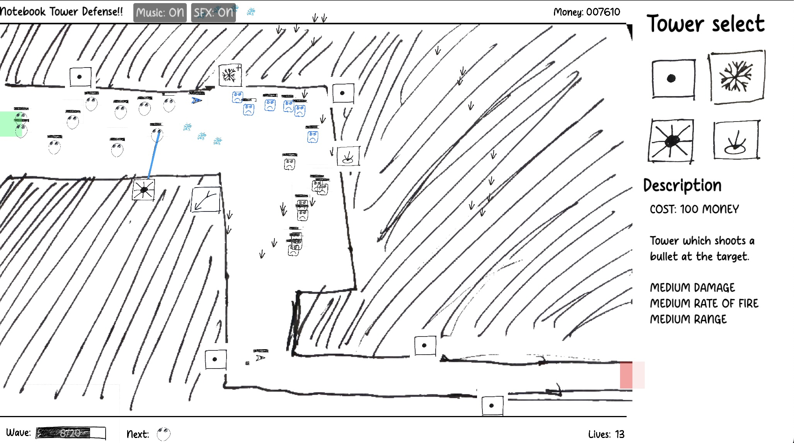

# Notebook Tower Defense
 

A tower defense game made in the Godot game engine.

_All the game assets are scribbled by me! In a notebook! (And I can’t draw!)_

## Playing the game
Play the game in your browser [here](https://ozuyatamutsu.github.io/notebook-tower-defense/).

See [Releases](https://github.com/OzuYatamutsu/notebook-tower-defense/releases) for the latest desktop release of the game,
or [the actions section](https://github.com/OzuYatamutsu/notebook-tower-defense/actions/workflows/deploy-desktop.yml)
for the latest development build.

## Building

Pull the repository and open `project.godot` in Godot 4.x or higher.

## Changelog

### 1.0.0 (2025-05-10)

- Initial release. (Game is technically playable).
- Includes 2 levels (1 proof of concept).
- Includes 2 enemy types.
- Includes 2 tower types.

